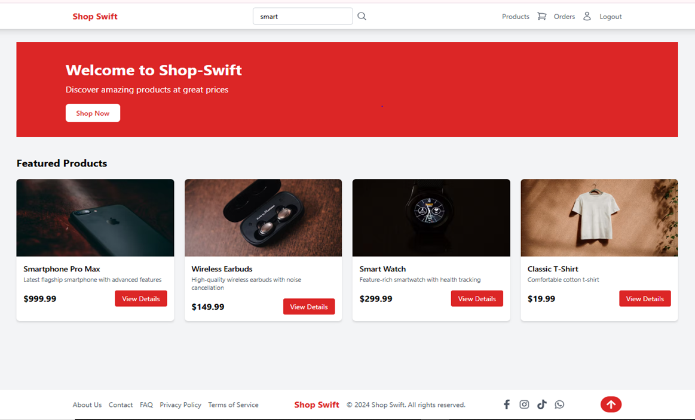
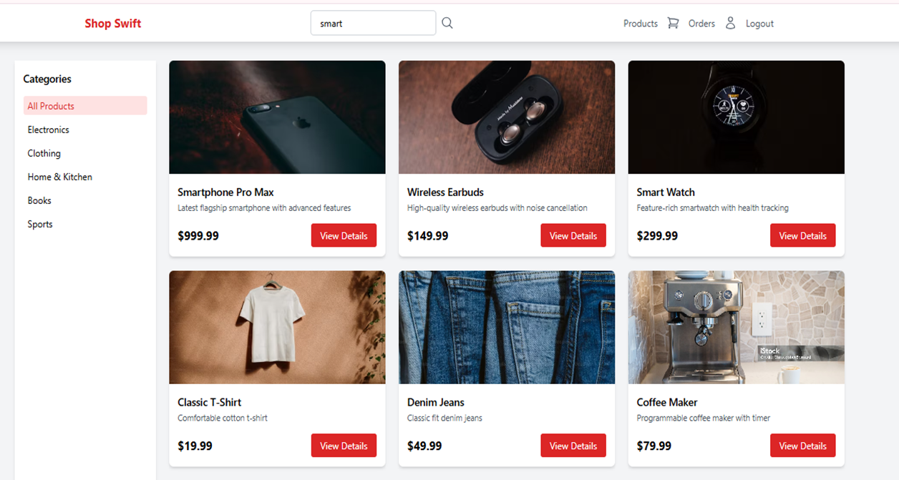
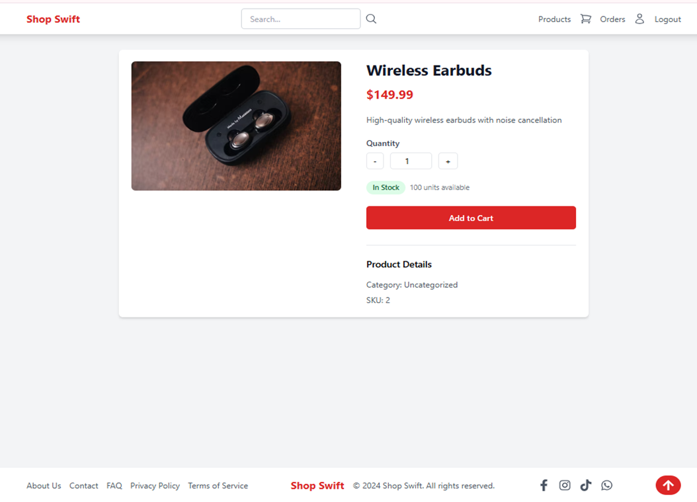
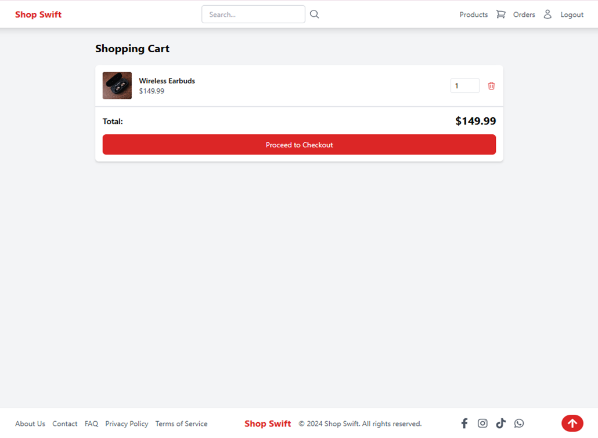
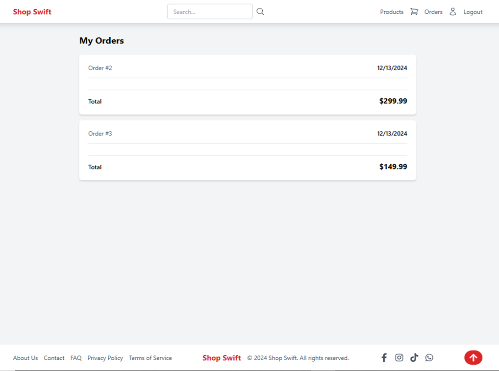

# E-Commerce Web Application

## Description
This is a full-stack e-commerce web application built with React (frontend) and Flask (backend). 
The application allows users to browse products, manage their shopping carts, place orders, and authenticate their accounts securely. 
The backend handles data persistence and includes user authentication and product management features.

## Features
- **User Authentication**: Signup, login, and JWT-secured sessions.
- **Product Browsing**: View products by category and search for specific items.
- **Shopping Cart**: Add, edit, and remove items from the cart.
- **Order Management**: Place orders and view past purchases.
- **Responsive Design**: Ensures a seamless experience across different screen sizes.
- **Admin Features**: Manage product stock and categories.

## Technologies Used
- **Frontend**: React, React Router
- **Backend**: Flask, Flask-RESTful, Flask-JWT-Extended
- **Database**: SQLAlchemy (MySQL)
- **Styling**: Tailwind CSS
- **API Design**: RESTful APIs
- **State Management**: Context API

## Installation

### Prerequisites
- Node.js
- Python 3.9+
- A SQL database

### Frontend Setup
1. Navigate to the `client` folder:
   ```bash
   cd client

2. Install dependencies: 
    npm install

3. Start the development server:
    npm start

### Backend Setup
Set up a virtual environment:
    python3 -m venv venv
    source venv/bin/activate  # On Windows: venv\Scripts\activate

Install dependencies:
    pip install -r requirements.txt
    Configure your database in the config.py file.

Initialize the database:
    python manage.py db init
    python manage.py db migrate
    python manage.py db upgrade

Run the Flask server:
    python app.py

### Accessing the Application
To access the application locally, open your browser and navigate to:

React frontend: http://localhost:3000

Flask backend: http://localhost:5555

## Live Demo
You can access the live deployed application at the following link:

Live Application: (https://shop-swift-2.onrender.com/)

## Screenshots
Home Page


Product Listing


Shopping Cart


Placing an Order


Order History


### Contributing
Contributions are welcome! Please submit a pull request or open an issue.

### License
This project is licensed under the MIT License.